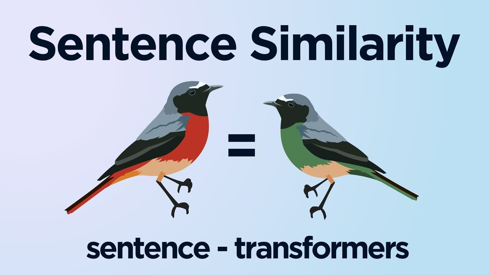

<h1 align="center">Welcome to weaviate-t2v-module</h1>



<p>

> Service that takes text as an input and returns it's vector representation. Texts with similar meaning will have similar vectors, texts with different meaning - different vectors.

This project was created as a replacement of the Weaviate's default text2vec-transformers module in order to use custom vectorization model ([sentence-transformer](https://github.com/UKPLab/sentence-transformers) pretrained model is used in this repo).

In order to create custom text2vec-transformers module these 4 endpoints have to be implemented (as it's described in [official documentation](https://weaviate.io/developers/weaviate/current/modules/custom-modules.html)):

- GET /.well-known/live -> respond 204 when the app is alive
- GET /.well-known/ready -> respond 204 when the app is ready to serve traffic
- GET /meta -> respond meta information about the inference model
- POST /vectors -> respond vector representation of the text

Though this module is created for Weaviate it can be used for any other purpose where text vectorization is required. Just use `/vectors` endpoint for it.
</p>

## How to use different model

Currently `paraphrase-MiniLM-L6-v2` pretrained sentence-transformer model is used as it's fastest. If you want to use any other pretrained model from [the list](https://www.sbert.net/docs/pretrained_models.html) then just change the model name in the **src/config/config.yaml** file.

In case of any other model then these three changes have to be made:

- **src/utils/meta.py** - change the way dictionary with model's meta info is generated
- **src/features/vectorizer.py** - adapt vectorization process to the new model
- **app.py** - instantiate new model

## Install

As this project uses pyproject.toml - [poetry](https://python-poetry.org/docs/) has to be installed.

Also take a look at the required python version (described in **pyproject.toml** file).

In order to install all required packages run this command (when you are in the folder with pyproject.toml file).

```sh
poetry install
```

## Usage

In order to run this service just start it with uvicorn:

```sh
python -m uvicorn app:app --port 8080
```

## Docker

In order to build docker image there is a helper script: **src/service/docker/build_docker_image.py.** It will build an image with the name and version that are specified in pyproject.toml file plus provides arguments from src/config/config.yaml file.

```sh
python src/service/docker/build_docker_image.py
```

After image is built it can be started with:

```sh
docker run -it --rm -p 8080:8080 weaviate-t2-module:[version]
```

**Examples of api calls can be found in src/service/api_calls.rest file.**

## Run tests

[Pytest](https://github.com/pytest-dev/pytest) framework is used for tests execution so in order to run all tests simply type:

```sh
pytest
```
